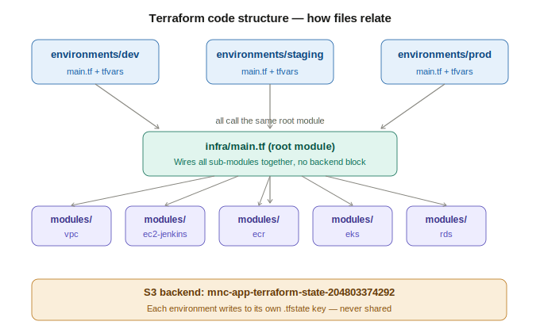

# MNC App — DevOps Infrastructure Setup Guide (Windows 11)

A production-grade 3-tier Java application deployed on AWS using Terraform, Jenkins, ECR, EKS, and RDS MySQL.
This guide is written entirely for **Windows 11 using PowerShell**. Every command here runs natively on Windows — no WSL required.

> **Before you start:** Read the entire guide once top-to-bottom before running any command. Understanding the full picture prevents costly mistakes, especially around the two-pass Terraform apply (Step 5) and the fact that pods only come up AFTER the first Jenkins pipeline run (Step 9).

---

## Table of Contents

1. [Project Overview — What Will Happen End to End](#1-project-overview--what-will-happen-end-to-end)
2. [Architecture Overview](#2-architecture-overview)
3. [Prerequisites — Install All Tools](#3-prerequisites--install-all-tools)
4. [Repository Structure](#4-repository-structure)
5. [Step 1 — AWS Account Preparation](#step-1--aws-account-preparation)
6. [Step 2 — Configure Your Local Machine](#step-2--configure-your-local-machine)
7. [Step 3 — Clone and Personalise the Repo](#step-3--clone-and-personalise-the-repo)
8. [Step 4 — Bootstrap Remote State](#step-4--bootstrap-remote-state)
9. [Step 5 — Deploy Dev Infrastructure (Two-Pass Apply)](#step-5--deploy-dev-infrastructure-two-pass-apply)
10. [Step 6 — Install the ALB Controller](#step-6--install-the-alb-controller)
11. [Step 7 — Prepare Kubernetes for the First Pipeline Run](#step-7--prepare-kubernetes-for-the-first-pipeline-run)
12. [Step 8 — Configure Jenkins](#step-8--configure-jenkins)
13. [Step 9 — Run Your First Pipeline (Pods Come Up Here)](#step-9--run-your-first-pipeline-pods-come-up-here)
14. [Step 10 — Deploy Staging and Prod](#step-10--deploy-staging-and-prod)
15. [Day-to-Day Operations](#day-to-day-operations)
16. [Troubleshooting](#troubleshooting)
17. [Estimated AWS Cost](#estimated-aws-cost)
18. [Quick Reference](#quick-reference--most-used-commands)

---

## 1. Project Overview — What Will Happen End to End

Read this section first. It explains every major event in order so nothing surprises you.

### Phase 1 — One-time setup on your Windows machine (Steps 1–3)

1. You create a dedicated IAM user `terraform-admin` in AWS console with AdministratorAccess. You never use root.
2. You configure AWS CLI with those credentials and set the default region to `ap-south-1`.
3. You install five tools: AWS CLI, Terraform, kubectl, Helm, Git — all via winget.
4. You clone the repo to `C:\Projects\mnc-devops-project`.
5. You run a PowerShell block that auto-detects your AWS account ID, your public IP, and the latest Amazon Linux 2023 AMI ID, then patches all three `terraform.tfvars` files with those real values.

### Phase 2 — Bootstrap remote state (Step 4)

6. You run a PowerShell bootstrap script that creates:
   - An S3 bucket (`mnc-app-terraform-state-<your-account-id>`) — stores Terraform state files securely
   - A DynamoDB table (`terraform-state-lock`) — prevents two people from running `terraform apply` at the same time
   - An EC2 key pair (`mnc-app-keypair`) — saved to `~\.ssh\` for SSH access to Jenkins if needed
7. The bucket name is patched into all three environment `main.tf` files automatically.

### Phase 3 — Provision AWS infrastructure for dev (Step 5)

8. You navigate to `infra/environments/dev` and run `terraform init`. Terraform downloads all provider plugins and connects to the S3 backend.
9. **Pass 1 of terraform apply** — You apply with `-target` flags that skip the Kubernetes namespace resource. This creates in one shot:
   - 1 VPC (`10.10.0.0/16`) with 2 public subnets, 2 private subnets, 2 NAT gateways, 1 internet gateway
   - 1 EKS cluster (`mnc-app-dev-cluster`) with 2 SPOT `t3.medium` worker nodes in private subnets
   - The aws-auth ConfigMap inside EKS — maps the Jenkins IAM role to `system:masters` so Jenkins can run kubectl
   - 1 Jenkins EC2 (`t3.large`) in a private subnet, behind an ALB in public subnets
   - 2 ECR repositories (`mnc-app/backend`, `mnc-app/frontend`) — empty for now
   - 1 RDS MySQL (`db.t3.micro`) in private subnets
   - All security groups, IAM roles, SSM parameters
   - SonarQube starts automatically as a Docker container on the Jenkins EC2 (port 9000)
10. You wait ~3 minutes for EKS nodes to register and show `Ready`.
11. **Pass 2 of terraform apply** — Full apply with no `-target` flags. This creates only the remaining resource: the `dev` Kubernetes namespace inside EKS.
12. You save the terraform outputs (cluster name, Jenkins ALB DNS, RDS endpoint, ECR URLs) to Notepad.
13. You patch the real RDS endpoint into `k8s/dev/configmap.yaml` and push to GitHub.

### Phase 4 — Install ALB Controller (Step 6)

14. You run a PowerShell script that installs the AWS Load Balancer Controller into EKS via Helm. This controller watches Kubernetes Ingress resources and automatically creates AWS ALBs. Without it, your `ingress.yaml` does nothing.

### Phase 5 — Prepare Kubernetes for the pipeline (Step 7)

15. You inject the DB password from SSM into a Kubernetes Secret (without writing it to any file).
16. You apply ONLY the non-deployment manifests: namespace, configmap, secret, services, ingress. **You do NOT apply the deployment YAML files here** — they contain placeholder strings (`ECR_REGISTRY_PLACEHOLDER`, `IMAGE_TAG_PLACEHOLDER`) that are only replaced by Jenkins at pipeline runtime.
17. The Kubernetes Ingress is created → the ALB Controller sees it → AWS provisions a real Application Load Balancer. This takes 2–3 minutes. You verify the ALB gets an address but you do NOT test the API yet — no pods are running.

> **Important:** At this point ECR has zero images. No pods exist. The ALB has no healthy targets. This is expected and correct. Pods come up in Step 9.

### Phase 6 — Configure Jenkins (Step 8)

18. You open the Jenkins URL (from terraform output) in your browser.
19. You get the initial admin password from AWS SSM Parameter Store (the Jenkins EC2 userdata script stored it there on first boot).
20. You install Jenkins plugins: Pipeline, Docker Pipeline, SonarQube Scanner, GitHub, Timestamper, AnsiColor, JaCoCo.
21. You create a GitHub Personal Access Token and add it as a Jenkins credential.
22. You open an SSM port-forwarding tunnel to reach SonarQube on `localhost:9000` (it runs on the Jenkins EC2 private IP — no public exposure).
23. You generate a SonarQube analysis token and add it as a Jenkins credential.
24. You configure the SonarQube server URL in Jenkins → Manage Jenkins → System.
25. You configure Java 17 and Maven 3.9 tool installations in Jenkins → Manage Jenkins → Tools.
26. You create a Multibranch Pipeline job pointing to your GitHub repo.
27. You add a GitHub webhook so pushes trigger builds instantly.

### Phase 7 — First pipeline run — pods come up here (Step 9)

28. You push a commit to the `develop` branch. Jenkins detects it via the webhook.
29. The pipeline runs these stages in order:
    - **Checkout** — prints branch, commit SHA, target environment
    - **Build & Unit Tests** — Maven compiles the Spring Boot app and runs all unit tests using H2 in-memory DB (no real MySQL needed in CI). JaCoCo measures code coverage — must be ≥70% or the pipeline fails.
    - **SonarQube Analysis** — Maven sends compiled code + coverage report to SonarQube for static analysis
    - **Quality Gate** — Pipeline waits (up to 10 min) for SonarQube to finish. If bugs/coverage/smells fail the gate, the pipeline stops here and nothing gets deployed.
    - **Docker Build & Push** — Builds the Spring Boot JAR into a Docker image using multi-stage Dockerfile (builder stage = Maven+Java, runtime stage = just the JAR on slim JRE). Builds React app into static files, packs into Nginx image. Both images are tagged `sha-<gitcommit>` and pushed to ECR.
    - **Deploy → DEV** — Jenkins runs `aws eks update-kubeconfig`, pulls DB password from SSM, creates/updates the Kubernetes Secret, uses `sed` to substitute real ECR URL and image tag into the deployment YAML copies in `/tmp`, then runs `kubectl apply`. Kubernetes pulls the images from ECR and starts the pods.
    - **Smoke Tests** — Hits `/actuator/health` and `/api/products` on the ALB. If HTTP 200 is returned, pipeline passes. If not, it automatically runs `kubectl rollout undo` to roll back.
30. **Pods are now Running.** Flyway runs on the Spring Boot app startup and automatically applies `V1__init_schema.sql` to create the `products` table in RDS.
31. You can now access the app at `http://<ALB_DNS>` — the React frontend loads and shows product data from MySQL via the Spring Boot API.

### Phase 8 — Staging and prod (Step 10)

32. Same two-pass Terraform apply for staging and prod environments — each gets its own VPC, EKS, RDS.
33. The Jenkins pipeline handles staging and prod deployments automatically from `release/*` and `main` branches respectively, with manual approval gates.

---

## 2. Architecture Overview

### Infrastructure Diagram

```
╔══════════════════════════════════════════════════════════════════════════════════╗
║  AWS REGION: ap-south-1                                                          ║
║                                                                                  ║
║  ┌─────────────────────────────────────────────────────────────────────────┐    ║
║  │  VPC: 10.10.0.0/16  (mnc-app-dev-vpc)                                   │    ║
║  │                                                                          │    ║
║  │  ┌──────────────────────────┐  ┌──────────────────────────┐             │    ║
║  │  │  PUBLIC SUBNET           │  │  PUBLIC SUBNET           │             │    ║
║  │  │  10.10.1.0/24            │  │  10.10.2.0/24            │             │    ║
║  │  │  AZ: ap-south-1a         │  │  AZ: ap-south-1b         │             │    ║
║  │  │                          │  │                          │             │    ║
║  │  │  ┌──────────────────┐    │  │  ┌──────────────────┐   │             │    ║
║  │  │  │  NAT Gateway 1   │    │  │  │  NAT Gateway 2   │   │             │    ║
║  │  │  │  + Elastic IP    │    │  │  │  + Elastic IP    │   │             │    ║
║  │  │  └──────────────────┘    │  │  └──────────────────┘   │             │    ║
║  │  │                          │  │                          │             │    ║
║  │  │  ┌──────────────────┐    │  │  ┌──────────────────┐   │             │    ║
║  │  │  │ Jenkins ALB      │    │  │  │ Jenkins ALB      │   │             │    ║
║  │  │  │ (cross-AZ)       │    │  │  │ (cross-AZ)       │   │             │    ║
║  │  │  │ Port 80/443      │    │  │  │ Port 80/443      │   │             │    ║
║  │  │  │ SG: alb-sg       │    │  │  │ SG: alb-sg       │   │             │    ║
║  │  │  └────────┬─────────┘    │  │  └──────────────────┘   │             │    ║
║  │  │           │              │  │                          │             │    ║
║  │  │  ┌────────┴─────────┐    │  │  ┌──────────────────┐   │             │    ║
║  │  │  │ App ALB          │    │  │  │ App ALB          │   │             │    ║
║  │  │  │ (cross-AZ)       │    │  │  │ (cross-AZ)       │   │             │    ║
║  │  │  │ Port 80          │    │  │  │                  │   │             │    ║
║  │  │  │ SG: alb-sg       │    │  │  │                  │   │             │    ║
║  │  │  └──────────────────┘    │  │  └──────────────────┘   │             │    ║
║  │  └──────────────────────────┘  └──────────────────────────┘             │    ║
║  │                 │ internet → private (via NAT)                           │    ║
║  │  ┌──────────────────────────┐  ┌──────────────────────────┐             │    ║
║  │  │  PRIVATE SUBNET          │  │  PRIVATE SUBNET          │             │    ║
║  │  │  10.10.10.0/24           │  │  10.10.11.0/24           │             │    ║
║  │  │  AZ: ap-south-1a         │  │  AZ: ap-south-1b         │             │    ║
║  │  │                          │  │                          │             │    ║
║  │  │  ┌──────────────────┐    │  │                          │             │    ║
║  │  │  │ Jenkins EC2      │    │  │                          │             │    ║
║  │  │  │ t3.large         │    │  │                          │             │    ║
║  │  │  │ SG: jenkins-sg   │    │  │                          │             │    ║
║  │  │  │ port 8080        │    │  │                          │             │    ║
║  │  │  │ port 9000        │    │  │                          │             │    ║
║  │  │  │ (SonarQube)      │    │  │                          │             │    ║
║  │  │  │ EBS: 50GB /home  │    │  │                          │             │    ║
║  │  │  │ IAM: jenkins-role│    │  │                          │             │    ║
║  │  │  └──────────────────┘    │  │                          │             │    ║
║  │  │                          │  │                          │             │    ║
║  │  │  ┌──────────────────┐    │  │  ┌──────────────────┐   │             │    ║
║  │  │  │ EKS Node 1       │    │  │  │ EKS Node 2       │   │             │    ║
║  │  │  │ t3.medium (SPOT) │    │  │  │ t3.medium (SPOT) │   │             │    ║
║  │  │  │ SG: eks-nodes-sg │    │  │  │ SG: eks-nodes-sg │   │             │    ║
║  │  │  │ Pods:            │    │  │  │ Pods:            │   │             │    ║
║  │  │  │  backend:8080    │    │  │  │  frontend:3000   │   │             │    ║
║  │  │  │ (dev: 1 replica) │    │  │  │ (dev: 1 replica) │   │             │    ║
║  │  │  └──────────────────┘    │  │  └──────────────────┘   │             │    ║
║  │  │                          │  │                          │             │    ║
║  │  │  ┌──────────────────┐    │  │  ┌──────────────────┐   │             │    ║
║  │  │  │ RDS MySQL        │    │  │  │ RDS MySQL        │   │             │    ║
║  │  │  │ db.t3.micro      │    │  │  │ (standby/        │   │             │    ║
║  │  │  │ SG: rds-sg       │    │  │  │  prod only)      │   │             │    ║
║  │  │  │ port 3306        │    │  │  │                  │   │             │    ║
║  │  │  └──────────────────┘    │  │  └──────────────────┘   │             │    ║
║  │  └──────────────────────────┘  └──────────────────────────┘             │    ║
║  └─────────────────────────────────────────────────────────────────────────┘    ║
║                                                                                  ║
║  ┌─────────────────────────────────────────────────────────────────────────┐    ║
║  │  GLOBAL AWS SERVICES (no VPC)                                            │    ║
║  │                                                                          │    ║
║  │  ECR: mnc-app/backend          ECR: mnc-app/frontend                    │    ║
║  │  (shared across dev/stg/prod)  (shared across dev/stg/prod)             │    ║
║  │                                                                          │    ║
║  │  S3: mnc-app-terraform-state-<account-id>   (Terraform remote state)    │    ║
║  │  DynamoDB: terraform-state-lock              (Terraform state locking)   │    ║
║  │  SSM: /mnc-app/dev/db/password              (DB password, SecureString) │    ║
║  │  SSM: /mnc-app/jenkins/initial-password     (Jenkins unlock password)   │    ║
║  └─────────────────────────────────────────────────────────────────────────┘    ║
╚══════════════════════════════════════════════════════════════════════════════════╝
```
### Terraform Module Structure



### Security Groups — What talks to what

```
Internet
   │
   ▼
Jenkins ALB SG (jenkins-alb-sg)
  Inbound:  port 80  from YOUR_IP/32
  Inbound:  port 443 from YOUR_IP/32
  Outbound: port 8080 to VPC CIDR (to Jenkins EC2)
   │
   ▼
Jenkins EC2 SG (jenkins-sg)
  Inbound:  port 8080 from VPC CIDR
  Inbound:  port 22   from VPC CIDR only (no public SSH)
  Outbound: all (needs GitHub, ECR, EKS API, SSM, DockerHub)

App ALB SG (alb-sg)
  Inbound:  port 80  from 0.0.0.0/0 (public app)
  Inbound:  port 443 from 0.0.0.0/0
  Outbound: port 8080 to EKS nodes (backend pods)
  Outbound: port 3000 to EKS nodes (frontend pods)
   │
   ▼
EKS Nodes SG (eks-nodes-sg)
  Inbound:  all traffic from self (pod-to-pod communication)
  Inbound:  port 443  from jenkins-sg (kubectl API calls)
  Inbound:  port 8080 from alb-sg (ALB to backend pods)
  Inbound:  port 3000 from alb-sg (ALB to frontend pods)
  Outbound: all (ECR image pull, CloudWatch, SSM)
   │
   ▼
RDS SG (rds-sg)
  Inbound:  port 3306 from eks-nodes-sg only (app pods → DB)
  Inbound:  port 3306 from jenkins-sg (Flyway migrations)
  Outbound: none
```

### EKS Cluster Structure

```
EKS Cluster: mnc-app-dev-cluster (Kubernetes 1.29)
│
├── kube-system namespace
│   ├── aws-load-balancer-controller (Helm, manages ALBs)
│   ├── coredns (DNS for pods)
│   ├── kube-proxy (network rules)
│   ├── vpc-cni (pod networking)
│   ├── ebs-csi-driver (persistent volumes)
│   └── aws-auth ConfigMap
│         └── Jenkins IAM role → system:masters (kubectl access)
│
└── dev namespace
    ├── ConfigMap: app-config
    │     DB_HOST, DB_NAME, DB_USERNAME, LOG_LEVEL, JAVA_OPTS
    ├── Secret: app-db-secret
    │     DB_PASSWORD (injected from SSM at deploy time)
    ├── Deployment: backend  (1 replica in dev, 3 in prod)
    │     Image: <ecr>/mnc-app/backend:sha-<gitcommit>
    │     Resources: 250m CPU / 512Mi RAM (request)
    │     Probes: readiness /actuator/health/readiness
    │             liveness  /actuator/health/liveness
    │             startup   /actuator/health
    ├── Deployment: frontend (1 replica in dev, 3 in prod)
    │     Image: <ecr>/mnc-app/frontend:sha-<gitcommit>
    │     Resources: 100m CPU / 128Mi RAM (request)
    │     Probes: readiness/liveness /health
    ├── Service: backend-service  (ClusterIP, port 80 → 8080)
    ├── Service: frontend-service (ClusterIP, port 80 → 3000)
    └── Ingress: app-ingress
          /api/*     → backend-service
          /actuator/* → backend-service
          /*          → frontend-service
          → triggers ALB Controller → creates AWS ALB
```

### CI/CD Flow

```
Developer pushes to 'develop' branch
          │
          ▼
    GitHub Webhook
          │
          ▼
    Jenkins (EC2 in private subnet)
          │
    ┌─────▼──────────────────────────────────────────┐
    │  Stage 1: Checkout                              │
    │  Stage 2: mvn clean install (unit tests, H2 DB) │
    │           JaCoCo coverage ≥ 70% enforced        │
    │  Stage 3: mvn sonar:sonar → SonarQube (port 9000│
    │           on same EC2)                          │
    │  Stage 4: waitForQualityGate → blocks if failed │
    │  Stage 5: docker build backend → ECR push       │
    │           docker build frontend → ECR push      │
    │           Image tag: sha-<gitcommit>            │
    │  Stage 6: aws eks update-kubeconfig             │
    │           Pull DB_PASSWORD from SSM             │
    │           kubectl create secret (overwrites)    │
    │           sed replaces placeholders in YAML     │
    │           kubectl apply deployment YAML         │
    │           kubectl rollout status (waits)        │
    │  Stage 7: curl /actuator/health → 200?          │
    │           curl /api/products → 200?             │
    │           FAIL → kubectl rollout undo           │
    └─────────────────────────────────────────────────┘
          │
          ▼
    Pods running in EKS dev namespace
    Flyway applies V1__init_schema.sql on startup
          │
          ▼
    App accessible at http://<ALB-DNS>
```

### What lives where — full component table

| Component | Type | Location | Size | Purpose |
|---|---|---|---|---|
| VPC | Network | ap-south-1 | 10.10.0.0/16 | Isolated network for all dev resources |
| Public Subnet 1 | Subnet | ap-south-1a | 10.10.1.0/24 | NAT GW, Jenkins ALB, App ALB |
| Public Subnet 2 | Subnet | ap-south-1b | 10.10.2.0/24 | NAT GW, ALBs (HA) |
| Private Subnet 1 | Subnet | ap-south-1a | 10.10.10.0/24 | Jenkins EC2, EKS Node 1, RDS primary |
| Private Subnet 2 | Subnet | ap-south-1b | 10.10.11.0/24 | EKS Node 2, RDS standby (prod only) |
| Internet Gateway | Gateway | VPC | — | Public subnets → internet |
| NAT Gateway 1 | Gateway | Public subnet 1 | — | Private subnet 1 → internet |
| NAT Gateway 2 | Gateway | Public subnet 2 | — | Private subnet 2 → internet |
| Jenkins EC2 | EC2 | Private subnet 1 | t3.large | Runs Jenkins + SonarQube (Docker) |
| Jenkins EBS | Storage | ap-south-1a | 50 GB gp3 | Jenkins home dir (jobs/builds persist) |
| Jenkins ALB | ALB | Public subnets | — | Public access to Jenkins UI |
| EKS Control Plane | Managed | AWS-managed | — | Kubernetes API server |
| EKS Node 1 | EC2 | Private subnet 1 | t3.medium SPOT | Runs backend pod |
| EKS Node 2 | EC2 | Private subnet 2 | t3.medium SPOT | Runs frontend pod |
| App ALB | ALB | Public subnets | — | Routes internet traffic to pods |
| RDS MySQL | RDS | Private subnets | db.t3.micro | App database |
| ECR backend | Registry | Global | — | Docker images for Spring Boot |
| ECR frontend | Registry | Global | — | Docker images for React+Nginx |
| S3 state bucket | S3 | Global | — | Terraform remote state |
| DynamoDB lock | DynamoDB | ap-south-1 | — | Terraform state locking |

### Branch → Environment mapping

| Git branch | Deploys to | Trigger | Approval |
|---|---|---|---|
| `feature/*` | nowhere | push | none — build + test only |
| `develop` | dev namespace | auto on push | none |
| `release/*` | staging namespace | auto on push | 1 person clicks Proceed in Jenkins |
| `main` | prod namespace | auto on push | 2 separate people click Proceed |

---

## 3. Prerequisites — Install All Tools

Open **PowerShell as Administrator** for all installation steps.
Right-click the Start button → **Terminal (Admin)** or **Windows PowerShell (Admin)**.

### 3.1 Enable script execution (one-time Windows setting)

By default Windows blocks PowerShell scripts. Run this once:

```powershell
Set-ExecutionPolicy -ExecutionPolicy RemoteSigned -Scope CurrentUser
# Type Y and press Enter when prompted
```

### 3.2 Verify winget is available

winget comes pre-installed on Windows 11:

```powershell
winget --version
# Expected: v1.x.x
```

If missing: open the Microsoft Store and search for **App Installer**.

### 3.3 Install AWS CLI v2

```powershell
winget install Amazon.AWSCLI
```

Close and reopen PowerShell, then verify:

```powershell
aws --version
# Expected: aws-cli/2.x.x Python/3.x.x Windows/11
```

### 3.4 Install Terraform

```powershell
winget install Hashicorp.Terraform
```

Close and reopen PowerShell, then verify:

```powershell
terraform version
# Expected: Terraform v1.6.x
```

### 3.5 Install kubectl

```powershell
winget install Kubernetes.kubectl
```

Verify:

```powershell
kubectl version --client
# Expected: Client Version: v1.29.x
```

### 3.6 Install Helm

```powershell
winget install Helm.Helm
```

Verify:

```powershell
helm version
# Expected: version.BuildInfo{Version:"v3.x.x", ...}
```

### 3.7 Install Git

```powershell
winget install Git.Git
```

Close and reopen PowerShell, then verify:

```powershell
git --version
# Expected: git version 2.x.x.windows.x
```

### 3.8 Fix Git line endings permanently

Run these two commands once. This prevents the LF/CRLF warnings on every `git add`:

```powershell
git config --global core.autocrlf false
git config --global core.eol lf
```

### 3.9 Verify all tools are on PATH

Close every PowerShell window and open a fresh one. Run this block:

```powershell
@("aws", "terraform", "kubectl", "helm", "git") | ForEach-Object {
    $cmd = $_
    try {
        $v = & $cmd --version 2>&1 | Select-Object -First 1
        Write-Host "OK  $cmd : $v" -ForegroundColor Green
    } catch {
        Write-Host "FAIL  $cmd : NOT FOUND - close and reopen PowerShell" -ForegroundColor Red
    }
}
```

All five must show green before continuing.

---

## 4. Repository Structure

```
mnc-devops-project\
│
├── infra\
│   ├── main.tf                     Root module — wires all sub-modules together
│   ├── variables.tf                All input variable declarations
│   ├── outputs.tf                  Values printed after terraform apply
│   ├── modules\
│   │   ├── vpc\                    VPC, subnets, NAT gateways, route tables, flow logs
│   │   ├── eks\                    EKS cluster, node groups, OIDC, aws-auth, add-ons
│   │   ├── ecr\                    ECR repos with lifecycle policies
│   │   ├── ec2-jenkins\            Jenkins EC2, ALB, IAM role, SGs, EBS, userdata
│   │   └── rds\                    MySQL RDS, subnet group, parameter group, SG
│   └── environments\
│       ├── dev\
│       │   ├── main.tf             Has terraform{} backend "s3" + kubernetes provider
│       │   ├── variables.tf
│       │   └── terraform.tfvars    Dev-specific values (SPOT, micro, 1 replica)
│       ├── staging\
│       │   └── ...                 Staging values (SPOT, small, 2 replicas)
│       └── prod\
│           └── ...                 Prod values (ON_DEMAND, Multi-AZ, 3 replicas + HPA)
│
├── app\
│   ├── backend\
│   │   ├── Dockerfile              Multi-stage: Maven builder → slim JRE runtime
│   │   ├── pom.xml                 Spring Boot, JPA, MySQL, Flyway, Actuator, JaCoCo
│   │   └── src\
│   │       ├── main\java\com\mnc\app\
│   │       │   ├── controller\     ProductController — REST endpoints /api/products
│   │       │   ├── service\        ProductService — business logic
│   │       │   ├── repository\     ProductRepository — JPA queries
│   │       │   └── model\          Product entity
│   │       ├── main\resources\
│   │       │   ├── application.properties       Production config (reads env vars)
│   │       │   ├── application-test.properties  Test config (H2 in-memory DB)
│   │       │   └── db\migration\
│   │       │       └── V1__init_schema.sql      Flyway creates tables on first startup
│   │       └── test\java\com\mnc\app\
│   │           └── ProductServiceTest.java       Unit tests (Mockito, no real DB)
│   ├── frontend\
│   │   ├── Dockerfile              Multi-stage: Node builder → Nginx runtime (~25MB image)
│   │   ├── nginx.conf              SPA routing, gzip, security headers, health endpoint
│   │   ├── package.json
│   │   └── src\
│   │       └── App.jsx             React product catalog — calls backend /api/products
│   └── database\
│       └── migration\
│           └── V1__init_schema.sql Reference copy (actual Flyway file is in src/main/resources)
│
├── k8s\
│   ├── dev\
│   │   ├── namespace.yaml          Creates 'dev' namespace
│   │   ├── configmap.yaml          DB_HOST, DB_NAME, LOG_LEVEL, JAVA_OPTS
│   │   ├── secret.yaml             PLACEHOLDER ONLY — Jenkins injects real DB_PASSWORD
│   │   ├── backend-deployment.yaml Contains ECR_REGISTRY_PLACEHOLDER/IMAGE_TAG_PLACEHOLDER
│   │   │                           Jenkins does sed substitution before kubectl apply
│   │   ├── frontend-deployment.yaml Same placeholders
│   │   ├── backend-service.yaml    ClusterIP service port 80 → 8080
│   │   ├── frontend-service.yaml   ClusterIP service port 80 → 3000
│   │   └── ingress.yaml            ALB Ingress: /api → backend, / → frontend
│   ├── staging\                    2 replicas, preferred anti-affinity
│   └── prod\                       3 replicas, required anti-affinity, HPA, PDB
│
├── jenkins\
│   └── Jenkinsfile                 Full CI/CD pipeline with approval gates
│
└── scripts\                        Bash equivalents for Linux/Mac team members
    ├── bootstrap.sh
    ├── install-alb-controller.sh
    ├── inject-secrets.sh
    └── rollback.sh
```

> **About `k8s/*/backend-deployment.yaml` and `frontend-deployment.yaml`:** These files contain the literal strings `ECR_REGISTRY_PLACEHOLDER` and `IMAGE_TAG_PLACEHOLDER`. You must NEVER run `kubectl apply` directly on these files. The Jenkins pipeline uses `sed` to replace those placeholders with the real ECR URL and git SHA tag into a `/tmp` copy, then applies the `/tmp` copy. You only ever `kubectl apply` the non-deployment manifests manually (namespace, configmap, secret, services, ingress).

---

## Step 1 — AWS Account Preparation

### 1.1 Create a dedicated IAM user for Terraform

> Never use your root account for automation.

1. Go to **AWS Console → IAM → Users → Create user**
2. Username: `terraform-admin`
3. Leave "Provide user access to AWS Management Console" **unchecked** (CLI only)
4. Permissions → **Attach policies directly** → tick `AdministratorAccess`
5. Create user → click the user → **Security credentials** tab
6. **Access keys → Create access key → Command Line Interface (CLI)**
7. Download the CSV — you need both Access Key ID and Secret Access Key

### 1.2 Configure AWS CLI

Open PowerShell (regular, not Admin):

```powershell
aws configure
```

```
AWS Access Key ID [None]:     PASTE_YOUR_ACCESS_KEY_ID
AWS Secret Access Key [None]: PASTE_YOUR_SECRET_ACCESS_KEY
Default region name [None]:   ap-south-1
Default output format [None]: json
```

Verify:

```powershell
aws sts get-caller-identity
```

Expected:
```json
{
    "UserId": "AIDA...",
    "Account": "123456789012",
    "Arn": "arn:aws:iam::123456789012:user/terraform-admin"
}
```

### 1.3 Store account ID as a PowerShell variable

```powershell
$AWS_ACCOUNT_ID = (aws sts get-caller-identity --query Account --output text)
Write-Host "Account ID: $AWS_ACCOUNT_ID"
```

> PowerShell variables only live for the current session. Re-run this if you close and reopen PowerShell.

---

## Step 2 — Configure Your Local Machine

### 2.1 Get the latest Amazon Linux 2023 AMI ID for ap-south-1

```powershell
$AMI_ID = aws ec2 describe-images `
    --owners amazon `
    --filters "Name=name,Values=al2023-ami-2023*-x86_64" `
              "Name=state,Values=available" `
    --query "sort_by(Images, &CreationDate)[-1].ImageId" `
    --output text `
    --region ap-south-1

Write-Host "Latest AMI ID: $AMI_ID"
```

### 2.2 Create the SSH key directory

```powershell
$sshDir = "$env:USERPROFILE\.ssh"
if (-not (Test-Path $sshDir)) {
    New-Item -ItemType Directory -Path $sshDir | Out-Null
    Write-Host "Created: $sshDir"
} else {
    Write-Host "Already exists: $sshDir"
}
```

---

## Step 3 — Clone and Personalise the Repo

### 3.1 Clone

```powershell
New-Item -ItemType Directory -Path "C:\Projects" -Force | Out-Null
Set-Location "C:\Projects"

git clone https://github.com/YOUR_USERNAME/mnc-devops-project.git
Set-Location mnc-devops-project
```

### 3.2 Patch all tfvars files with your real values

```powershell
$ACCOUNT_ID = (aws sts get-caller-identity --query Account --output text)
$AMI_ID     = aws ec2 describe-images `
                  --owners amazon `
                  --filters "Name=name,Values=al2023-ami-2023*-x86_64" `
                            "Name=state,Values=available" `
                  --query "sort_by(Images, &CreationDate)[-1].ImageId" `
                  --output text `
                  --region ap-south-1

Write-Host "Account ID : $ACCOUNT_ID"
Write-Host "AMI ID     : $AMI_ID"

$files = @(
    "infra\environments\dev\terraform.tfvars",
    "infra\environments\staging\terraform.tfvars",
    "infra\environments\prod\terraform.tfvars"
)

foreach ($file in $files) {
    $content = Get-Content $file -Raw
    $content = $content -replace "123456789012",          $ACCOUNT_ID
    $content = $content -replace "ami-0f58b397bc5c1f2e8", $AMI_ID
    $content = $content -replace "ami-0e267a9919cdf778f", $AMI_ID
    Set-Content -Path $file -Value $content -NoNewline
    Write-Host "Updated: $file" -ForegroundColor Green
}
```

### 3.3 Verify

```powershell
Select-String `
    -Path "infra\environments\dev\terraform.tfvars" `
    -Pattern "aws_account_id|allowed_cidr|jenkins_ami_id"
```

You should see your real account ID, real IP with `/32`, and real AMI ID — not placeholders.

### 3.4 Understanding the Terraform module structure

```
environments/dev/main.tf   ← you run terraform from HERE (has backend "s3" block)
  └── calls source = "../../"
        └── infra/main.tf  ← root module — no backend block (modules cannot have one)
              ├── modules/vpc/
              ├── modules/ec2-jenkins/
              ├── modules/ecr/
              ├── modules/eks/
              └── modules/rds/
```

### 3.5 Push to GitHub

```powershell
git add .
git commit -m "config: set account ID, IP, and AMI for all environments"
git push origin main

# Create the develop branch — Jenkins pipeline needs it
git checkout -b develop
git push -u origin develop
git checkout main
```

---

## Step 4 — Bootstrap Remote State

Run this **once only**, before any `terraform` command.

```powershell
$AWS_REGION    = "ap-south-1"
$ACCOUNT_ID    = (aws sts get-caller-identity --query Account --output text)
$STATE_BUCKET  = "mnc-app-terraform-state-$ACCOUNT_ID"
$LOCK_TABLE    = "terraform-state-lock"
$KEY_PAIR_NAME = "mnc-app-keypair"

Write-Host "Bucket : $STATE_BUCKET"
Write-Host "Table  : $LOCK_TABLE"

# [1/4] S3 bucket
$exists = aws s3api head-bucket --bucket $STATE_BUCKET 2>&1
if ($LASTEXITCODE -eq 0) {
    Write-Host "[1/4] Bucket already exists" -ForegroundColor Green
} else {
    aws s3api create-bucket --bucket $STATE_BUCKET --region $AWS_REGION `
        --create-bucket-configuration LocationConstraint=$AWS_REGION | Out-Null
    aws s3api put-bucket-versioning --bucket $STATE_BUCKET `
        --versioning-configuration Status=Enabled | Out-Null
    $enc = '{"Rules":[{"ApplyServerSideEncryptionByDefault":{"SSEAlgorithm":"AES256"}}]}'
    aws s3api put-bucket-encryption --bucket $STATE_BUCKET `
        --server-side-encryption-configuration $enc | Out-Null
    aws s3api put-public-access-block --bucket $STATE_BUCKET `
        --public-access-block-configuration `
        "BlockPublicAcls=true,IgnorePublicAcls=true,BlockPublicPolicy=true,RestrictPublicBuckets=true" | Out-Null
    Write-Host "[1/4] S3 bucket created and secured" -ForegroundColor Green
}

# [2/4] DynamoDB
$tableCheck = aws dynamodb describe-table --table-name $LOCK_TABLE --region $AWS_REGION 2>&1
if ($LASTEXITCODE -eq 0) {
    Write-Host "[2/4] DynamoDB table already exists" -ForegroundColor Green
} else {
    aws dynamodb create-table --table-name $LOCK_TABLE `
        --attribute-definitions AttributeName=LockID,AttributeType=S `
        --key-schema AttributeName=LockID,KeyType=HASH `
        --billing-mode PAY_PER_REQUEST --region $AWS_REGION | Out-Null
    Write-Host "[2/4] DynamoDB table created" -ForegroundColor Green
}

# [3/4] EC2 key pair
$keyCheck = aws ec2 describe-key-pairs --key-names $KEY_PAIR_NAME --region $AWS_REGION 2>&1
if ($LASTEXITCODE -eq 0) {
    Write-Host "[3/4] Key pair already exists" -ForegroundColor Green
} else {
    $keyMaterial = aws ec2 create-key-pair --key-name $KEY_PAIR_NAME `
        --region $AWS_REGION --query "KeyMaterial" --output text
    $keyPath = "$env:USERPROFILE\.ssh\$KEY_PAIR_NAME.pem"
    $keyMaterial | Set-Content -Path $keyPath -NoNewline
    $acl = Get-Acl $keyPath
    $acl.SetAccessRuleProtection($true, $false)
    $acl.AddAccessRule((New-Object System.Security.AccessControl.FileSystemAccessRule(
        $env:USERNAME, "Read", "Allow")))
    Set-Acl $keyPath $acl
    Write-Host "[3/4] Key pair created → $keyPath (back this up!)" -ForegroundColor Green
}

# [4/4] Patch bucket name into environment main.tf files
foreach ($file in @("infra\environments\dev\main.tf",
                     "infra\environments\staging\main.tf",
                     "infra\environments\prod\main.tf")) {
    $c = Get-Content $file -Raw
    $c = $c -replace 'bucket\s*=\s*"mnc-app-terraform-state"', "bucket = `"$STATE_BUCKET`""
    Set-Content -Path $file -Value $c -NoNewline
    Write-Host "[4/4] Updated: $file" -ForegroundColor Green
}

Write-Host "Bootstrap complete." -ForegroundColor Cyan
```

---

## Step 5 — Deploy Dev Infrastructure (Two-Pass Apply)

> **Why two passes?** The `kubernetes` Terraform provider needs the EKS cluster endpoint to exist before it can create the `kubernetes_namespace` resource. On the very first apply the cluster doesn't exist yet. Running a single `terraform apply` fails with `dial tcp: connection refused`. Pass 1 creates all AWS resources. Pass 2 (after EKS is healthy) creates the Kubernetes namespace.

### 5.1 Navigate to dev environment

```powershell
Set-Location "C:\Projects\mnc-devops-project\infra\environments\dev"
```

### 5.2 Initialise Terraform

```powershell
terraform init
```

Expected last lines:
```
Successfully configured the backend "s3"!
Terraform has been successfully initialized!
```

> **"Error: Failed to get existing workspaces"** — S3 bucket not found. Go back to Step 4.

### 5.3 Pass 1 — Create all AWS infrastructure

This creates VPC, EKS, Jenkins EC2, ECR, RDS, all security groups, IAM roles, SSM parameters, and the aws-auth ConfigMap inside EKS. It intentionally skips `kubernetes_namespace` because EKS doesn't exist yet when this starts.

```powershell
terraform apply `
    -target="module.dev.module.vpc" `
    -target="module.dev.module.jenkins" `
    -target="module.dev.module.ecr" `
    -target="module.dev.module.eks" `
    -target="module.dev.module.rds" `
    -target="module.dev.aws_security_group.alb" `
    -target="module.dev.aws_ssm_parameter.db_host" `
    -target="module.dev.aws_ssm_parameter.db_name" `
    -target="module.dev.aws_ssm_parameter.db_password" `
    -target="module.dev.aws_ssm_parameter.ecr_registry" `
    -var-file="terraform.tfvars" `
    -var="db_password=DevPass123!"
```

Type `yes` when prompted. EKS takes **10–15 minutes**. Expected result:
```
Apply complete! Resources: 60+ added, 0 changed, 0 destroyed.
```

### 5.4 Wait for EKS nodes to become Ready

```powershell
aws eks update-kubeconfig --region ap-south-1 --name mnc-app-dev-cluster

kubectl get nodes -w
# Wait until both nodes show STATUS = Ready, then press Ctrl+C
```

Expected:
```
NAME                                          STATUS   ROLES    AGE
ip-10-10-10-xx.ap-south-1.compute.internal   Ready    <none>   2m
ip-10-10-11-xx.ap-south-1.compute.internal   Ready    <none>   2m
```

### 5.5 Pass 2 — Full apply (creates the Kubernetes dev namespace)

```powershell
terraform apply `
    -var-file="terraform.tfvars" `
    -var="db_password=DevPass123!"
```

Type `yes`. This creates only one remaining resource:
```
+ module.dev.kubernetes_namespace.env
Apply complete! Resources: 1 added, 0 changed, 0 destroyed.
```

### 5.6 Save the terraform outputs

```powershell
terraform output
```

**Copy the entire output into Notepad.** You will need these values in later steps:
```
cluster_name    = "mnc-app-dev-cluster"
jenkins_alb_dns = "mnc-app-jenkins-alb-12345.ap-south-1.elb.amazonaws.com"
db_endpoint     = "mnc-app-dev-mysql.abc123.ap-south-1.rds.amazonaws.com:3306"
ecr_repository_urls = {
  "backend"  = "123456789012.dkr.ecr.ap-south-1.amazonaws.com/mnc-app/backend"
  "frontend" = "123456789012.dkr.ecr.ap-south-1.amazonaws.com/mnc-app/frontend"
}
```

### 5.7 Update the dev ConfigMap with the real RDS endpoint

```powershell
Set-Location "C:\Projects\mnc-devops-project"

$RDS_HOST = (terraform -chdir="infra\environments\dev" output -raw db_endpoint) -replace ":3306", ""

$cm = Get-Content "k8s\dev\configmap.yaml" -Raw
$cm = $cm -replace "mnc-app-dev-mysql\.[a-zA-Z0-9]+\.ap-south-1\.rds\.amazonaws\.com", $RDS_HOST
Set-Content -Path "k8s\dev\configmap.yaml" -Value $cm -NoNewline

Write-Host "ConfigMap updated with: $RDS_HOST" -ForegroundColor Green

git add k8s\dev\configmap.yaml
git commit -m "config: update dev ConfigMap with real RDS endpoint"
git push origin main
```

---

## Step 6 — Install the ALB Controller

Without this controller, applying `ingress.yaml` creates the Ingress resource in Kubernetes but no real AWS ALB is ever provisioned. The ALB Controller watches for Ingress resources and creates the AWS ALB automatically.

```powershell
Set-Location "C:\Projects\mnc-devops-project"

$AWS_REGION   = "ap-south-1"
$ACCOUNT_ID   = (aws sts get-caller-identity --query Account --output text)
$CLUSTER_NAME = "mnc-app-dev-cluster"
$POLICY_NAME  = "AWSLoadBalancerControllerIAMPolicy"
$ROLE_NAME    = "mnc-app-dev-alb-controller-role"

New-Item -ItemType Directory -Path "C:\Temp" -Force | Out-Null

# [1/4] IAM Policy
$policyCheck = aws iam get-policy `
    --policy-arn "arn:aws:iam::${ACCOUNT_ID}:policy/$POLICY_NAME" 2>&1
if ($LASTEXITCODE -ne 0) {
    Invoke-WebRequest `
        -Uri "https://raw.githubusercontent.com/kubernetes-sigs/aws-load-balancer-controller/main/docs/install/iam_policy.json" `
        -OutFile "C:\Temp\alb-policy.json" -UseBasicParsing
    aws iam create-policy --policy-name $POLICY_NAME `
        --policy-document "file://C:\Temp\alb-policy.json"
    Write-Host "[1/4] IAM policy created" -ForegroundColor Green
} else {
    Write-Host "[1/4] IAM policy already exists" -ForegroundColor Green
}

# [2/4] IRSA role
$OIDC = (aws eks describe-cluster --name $CLUSTER_NAME --region $AWS_REGION `
    --query "cluster.identity.oidc.issuer" --output text) -replace "https://", ""

$trust = @"
{
  "Version": "2012-10-17",
  "Statement": [{
    "Effect": "Allow",
    "Principal": { "Federated": "arn:aws:iam::${ACCOUNT_ID}:oidc-provider/${OIDC}" },
    "Action": "sts:AssumeRoleWithWebIdentity",
    "Condition": {
      "StringEquals": {
        "${OIDC}:sub": "system:serviceaccount:kube-system:aws-load-balancer-controller",
        "${OIDC}:aud": "sts.amazonaws.com"
      }
    }
  }]
}
"@
[System.IO.File]::WriteAllText("C:\Temp\alb-trust.json", $trust)

$roleCheck = aws iam get-role --role-name $ROLE_NAME 2>&1
if ($LASTEXITCODE -ne 0) {
    aws iam create-role --role-name $ROLE_NAME `
        --assume-role-policy-document "file://C:\Temp\alb-trust.json"
    aws iam attach-role-policy --role-name $ROLE_NAME `
        --policy-arn "arn:aws:iam::${ACCOUNT_ID}:policy/$POLICY_NAME"
    Write-Host "[2/4] IRSA role created" -ForegroundColor Green
} else {
    Write-Host "[2/4] IRSA role already exists" -ForegroundColor Green
}

# [3/4] Get VPC ID
$VPC_ID = aws eks describe-cluster --name $CLUSTER_NAME --region $AWS_REGION `
    --query "cluster.resourcesVpcConfig.vpcId" --output text
$ROLE_ARN = "arn:aws:iam::${ACCOUNT_ID}:role/$ROLE_NAME"

# [4/4] Helm install
helm repo add eks https://aws.github.io/eks-charts 2>$null
helm repo update | Out-Null

helm upgrade --install aws-load-balancer-controller eks/aws-load-balancer-controller `
    --namespace kube-system `
    --set clusterName=$CLUSTER_NAME `
    --set serviceAccount.create=true `
    --set serviceAccount.name=aws-load-balancer-controller `
    --set "serviceAccount.annotations.eks\.amazonaws\.com/role-arn=$ROLE_ARN" `
    --set region=$AWS_REGION `
    --set vpcId=$VPC_ID `
    --wait

kubectl get deployment aws-load-balancer-controller -n kube-system
Write-Host "[4/4] ALB Controller ready" -ForegroundColor Green

Remove-Item "C:\Temp\alb-policy.json" -Force -ErrorAction SilentlyContinue
Remove-Item "C:\Temp\alb-trust.json"  -Force -ErrorAction SilentlyContinue
```

---

## Step 7 — Prepare Kubernetes for the First Pipeline Run

> **Critical — read this before running anything in this step.**
>
> The deployment YAML files (`backend-deployment.yaml`, `frontend-deployment.yaml`) contain literal placeholder strings `ECR_REGISTRY_PLACEHOLDER` and `IMAGE_TAG_PLACEHOLDER`. These are replaced by `sed` inside the Jenkins pipeline at deploy time. **You must never run `kubectl apply -f k8s\dev\` directly** — that would apply the placeholder strings as-is and Kubernetes would try to pull an image literally named `ECR_REGISTRY_PLACEHOLDER/mnc-app/backend:IMAGE_TAG_PLACEHOLDER`, which does not exist.
>
> In this step you only apply the non-deployment manifests: namespace, configmap, secret, services, and ingress. The deployment manifests are applied exclusively by the Jenkins pipeline in Step 9.

### 7.1 Inject the database secret into Kubernetes

```powershell
$ENV_NAME = "dev"
$PROJECT  = "mnc-app"
$REGION   = "ap-south-1"

$DB_PASS = aws ssm get-parameter `
    --name "/$PROJECT/$ENV_NAME/db/password" `
    --with-decryption `
    --query "Parameter.Value" `
    --output text `
    --region $REGION

kubectl create secret generic app-db-secret `
    "--from-literal=DB_PASSWORD=$DB_PASS" `
    --namespace=$ENV_NAME `
    --dry-run=client -o yaml | kubectl apply -f -

Remove-Variable DB_PASS

Write-Host "Secret injected into namespace '$ENV_NAME'" -ForegroundColor Green
```

### 7.2 Apply non-deployment manifests only

```powershell
Set-Location "C:\Projects\mnc-devops-project"

# Apply these files one by one — NOT kubectl apply -f k8s\dev\ (that includes deployment files)
kubectl apply -f k8s\dev\namespace.yaml
kubectl apply -f k8s\dev\configmap.yaml
kubectl apply -f k8s\dev\secret.yaml
kubectl apply -f k8s\dev\backend-service.yaml
kubectl apply -f k8s\dev\frontend-service.yaml
kubectl apply -f k8s\dev\ingress.yaml
```

Expected output:
```
namespace/dev configured
configmap/app-config configured
secret/app-db-secret configured
service/backend-service created
service/frontend-service created
ingress.networking.k8s.io/app-ingress created
```

### 7.3 Verify the ALB is being provisioned

The ALB Controller sees the new Ingress and begins creating an AWS ALB. This takes 2–3 minutes.

```powershell
# Watch the ingress until ADDRESS column shows a hostname
kubectl get ingress app-ingress -n dev -w
# Press Ctrl+C when ADDRESS is populated
```

Expected when ready:
```
NAME          CLASS   HOSTS   ADDRESS                                          PORTS
app-ingress   alb     *       mnc-app-xxxx.ap-south-1.elb.amazonaws.com        80
```

Save that ALB DNS name to your Notepad. The app is not accessible yet — no pods are running. Proceed to Step 8 to configure Jenkins, then Step 9 to trigger the pipeline that builds images and deploys pods.

---

## Step 8 — Configure Jenkins

### 8.1 Open Jenkins in your browser

```powershell
$JENKINS_DNS = terraform -chdir="infra\environments\dev" output -raw jenkins_alb_dns
Write-Host "Open in browser: http://$JENKINS_DNS"
```

> **HTTP only for now:** The HTTPS listener is only created when `acm_certificate_arn` is set. For this lab use `http://`. For production, request a free ACM certificate in **AWS Console → Certificate Manager → Request → public certificate**, then add `acm_certificate_arn = "arn:aws:acm:ap-south-1:ACCOUNT:certificate/UUID"` to `terraform.tfvars` and re-run `terraform apply`.

### 8.2 Get the initial admin password

```powershell
aws ssm get-parameter `
    --name "/mnc-app/jenkins/initial-password" `
    --with-decryption `
    --query "Parameter.Value" `
    --output text `
    --region ap-south-1
```

Paste this into the Jenkins unlock screen.

> **"Parameter not found"?** The EC2 userdata script takes 5–8 minutes after instance creation. Check progress:
> ```powershell
> $JENKINS_ID = aws ec2 describe-instances `
>     --filters "Name=tag:Name,Values=mnc-app-jenkins-master" `
>     --query "Reservations[0].Instances[0].InstanceId" `
>     --output text --region ap-south-1
>
> aws ssm send-command `
>     --instance-ids $JENKINS_ID `
>     --document-name "AWS-RunShellScript" `
>     --parameters "commands=['tail -50 /var/log/jenkins-setup.log']" `
>     --region ap-south-1 --query "Command.CommandId" --output text
> # Check: AWS Console → Systems Manager → Run Command → latest command → Output
> ```

### 8.3 Install plugins

**Customize Jenkins screen → Install suggested plugins** (~5 minutes).

After restart: **Manage Jenkins → Plugins → Available plugins** — install:

| Plugin | Why |
|---|---|
| `Pipeline` | Jenkinsfile support |
| `Docker Pipeline` | `docker.build` / `docker.push` steps |
| `SonarQube Scanner` | `withSonarQubeEnv` + `waitForQualityGate` |
| `GitHub` | Webhook triggers |
| `Timestamper` | Timestamps on every log line |
| `AnsiColor` | Coloured console output |
| `JaCoCo` | Code coverage reports |

After installing → **Restart Jenkins**.

### 8.4 Create a GitHub Personal Access Token

1. Open `https://github.com/settings/tokens`
2. **Generate new token (classic)**
3. Name: `jenkins-mnc-app`
4. Scopes: tick `repo` (all sub-items) and `admin:repo_hook`
5. **Generate** — copy immediately (shown only once)

### 8.5 Add credentials in Jenkins

**Manage Jenkins → Credentials → System → Global credentials → Add Credentials**

GitHub credential:

| Field | Value |
|---|---|
| Kind | `Username with password` |
| Username | your GitHub username |
| Password | GitHub token from 8.4 |
| ID | `github-credentials` |

SonarQube token (add after Step 8.6):

| Field | Value |
|---|---|
| Kind | `Secret text` |
| Secret | token from SonarQube |
| ID | `sonarqube-token` |

### 8.6 Access SonarQube via SSM tunnel

SonarQube runs on port 9000 on the Jenkins EC2 private IP. You reach it via SSM port-forwarding — no public exposure needed.

**Install SSM Session Manager plugin once:**

```powershell
Invoke-WebRequest `
    -Uri "https://s3.amazonaws.com/session-manager-downloads/plugin/latest/windows/SessionManagerPluginSetup.exe" `
    -OutFile "$env:TEMP\SSMPlugin.exe" -UseBasicParsing

Start-Process "$env:TEMP\SSMPlugin.exe" -Wait -Verb RunAs
# Close and reopen PowerShell after this
```

**Open the tunnel in a dedicated PowerShell window — keep it open the entire time you use SonarQube:**

```powershell
$JENKINS_ID = aws ec2 describe-instances `
    --filters "Name=tag:Name,Values=mnc-app-jenkins-master" `
    --query "Reservations[0].Instances[0].InstanceId" `
    --output text --region ap-south-1

aws ssm start-session `
    --target $JENKINS_ID `
    --document-name AWS-StartPortForwardingSession `
    --parameters "portNumber=9000,localPortNumber=9000" `
    --region ap-south-1
```

Open `http://localhost:9000` in your browser. Login: `admin` / `admin` → change password.

Generate analysis token:
1. Top-right → **admin** → **My Account** → **Security** tab
2. **Generate Tokens** → Name: `jenkins-token`, Type: **Global Analysis Token**
3. Copy the token → add as Jenkins credential `sonarqube-token`

### 8.7 Configure SonarQube server in Jenkins

**Manage Jenkins → System → SonarQube servers → Add SonarQube:**

| Field | Value |
|---|---|
| Name | `SonarQube-Server` ← exact — Jenkinsfile uses this string |
| Server URL | `http://localhost:9000` |
| Server auth token | select `sonarqube-token` |

Save.

### 8.8 Configure Java and Maven tools

**Manage Jenkins → Tools:**

**JDK → Add JDK:**
- Name: `Java-17` ← exact — Jenkinsfile uses `jdk 'Java-17'`
- Install automatically: ✓, Version: Java 17

**Maven → Add Maven:**
- Name: `Maven-3.9` ← exact — Jenkinsfile uses `maven 'Maven-3.9'`
- Install automatically: ✓, Version: 3.9.6

Save.

### 8.9 Create the Multibranch Pipeline job

1. Jenkins home → **New Item**
2. Name: `mnc-app-pipeline`, Type: **Multibranch Pipeline** → OK
3. **Branch Sources → Add source → GitHub**
   - Credentials: `github-credentials`
   - Repository URL: `https://github.com/YOUR_USERNAME/mnc-devops-project`
4. **Build Configuration** → Script Path: `jenkins/Jenkinsfile`
5. **Scan Triggers** → Periodically if not otherwise run → 1 minute
6. Save

Jenkins scans immediately and discovers `main` and `develop` branches.

### 8.10 Add GitHub webhook

In your GitHub repo: **Settings → Webhooks → Add webhook**

| Field | Value |
|---|---|
| Payload URL | `http://<JENKINS_ALB_DNS>/github-webhook/` |
| Content type | `application/json` |
| Which events | Just the push event |

---

## Step 9 — Run Your First Pipeline (Pods Come Up Here)

> **This is the step where pods actually start running.** Up to this point ECR has zero images and no pods exist. The pipeline builds the Docker images, pushes them to ECR, and deploys them to EKS. Only after this step is the application accessible.

### 9.1 Trigger a dev build

```powershell
Set-Location "C:\Projects\mnc-devops-project"
git checkout develop

Add-Content -Path "README.md" -Value "`n<!-- trigger: first pipeline run -->"

git add .
git commit -m "trigger: first dev pipeline run"
git push origin develop
```

Jenkins detects the push via webhook and starts the pipeline. Go to **Jenkins → mnc-app-pipeline → develop** to watch.

### 9.2 Pipeline stages — what happens in order

```
Stage 1: Checkout
  → Prints branch name, git commit SHA, target environment (dev)

Stage 2: Build & Unit Tests
  → mvn clean install
  → Spring Boot compiles with Java 17
  → Unit tests run using H2 in-memory DB (no real MySQL needed here)
  → JaCoCo measures coverage — must be ≥70% or pipeline stops
  → JUnit results published in Jenkins UI

Stage 3: SonarQube Analysis
  → mvn sonar:sonar
  → Sends compiled code + JaCoCo coverage XML to SonarQube on localhost:9000
  → SonarQube analyses bugs, code smells, vulnerabilities, duplications

Stage 4: Quality Gate
  → Pipeline waits (up to 10 minutes) for SonarQube to finish analysis
  → If Quality Gate fails → pipeline stops, nothing gets deployed

Stage 5: Docker Build & Push to ECR
  → docker build for backend (multi-stage: Maven builder → slim JRE)
  → docker build for frontend (multi-stage: Node builder → Nginx)
  → Both images tagged: sha-<gitcommit>  (e.g. sha-a3f2c1d)
  → docker push both images to ECR
  → ECR now has real images for the first time

Stage 6: Deploy → DEV
  → aws eks update-kubeconfig (Jenkins points kubectl at dev cluster)
  → Pull DB_PASSWORD from SSM Parameter Store
  → kubectl create secret (overwrites the placeholder secret.yaml value)
  → sed replaces ECR_REGISTRY_PLACEHOLDER and IMAGE_TAG_PLACEHOLDER
    in /tmp copies of backend-deployment.yaml and frontend-deployment.yaml
  → kubectl apply the /tmp copies (deployment files with real values)
  → kubectl rollout status → waits until all pods are Running

Stage 7: Smoke Tests
  → curl http://<ALB>/actuator/health → must return HTTP 200
  → curl http://<ALB>/api/products    → must return HTTP 200
  → PASS → pipeline succeeds
  → FAIL → kubectl rollout undo (automatic rollback) → pipeline fails
```

First run: ~10 minutes (Maven downloads all dependencies). Subsequent runs: ~4–5 minutes.

### 9.3 Verify pods are running

After the pipeline completes successfully:

```powershell
kubectl get pods -n dev
```

Expected:
```
NAME                        READY   STATUS    RESTARTS   AGE
backend-xxxxxxxxx-xxxxx     1/1     Running   0          2m
frontend-xxxxxxxxx-xxxxx    1/1     Running   0          2m
```

### 9.4 Test the application

```powershell
$ALB = kubectl get ingress app-ingress -n dev `
    -o jsonpath='{.status.loadBalancer.ingress[0].hostname}'

Write-Host "App URL: http://$ALB"

# Test the REST API
(Invoke-WebRequest -Uri "http://$ALB/api/products" -UseBasicParsing).Content
```

You should see the JSON product list from MySQL (seeded by Flyway on first pod startup).

### 9.5 Test the staging approval gate

```powershell
git checkout -b release/1.0.0
git push origin release/1.0.0
```

Jenkins picks up the branch. When the pipeline pauses at **"Approval: Deploy to STAGING?"**, go to Jenkins UI and click **Deploy to Staging**. Staging must already have infrastructure (Step 10) for this to succeed.

### 9.6 Test the prod dual-approval gate

```powershell
git checkout main
git merge release/1.0.0
git push origin main
```

Jenkins pauses twice — Tech Lead approval then DevOps Manager approval. In the lab you click both yourself.

---

## Step 10 — Deploy Staging and Prod

### 10.1 Staging infrastructure

Same two-pass apply as dev.

```powershell
Set-Location "C:\Projects\mnc-devops-project\infra\environments\staging"
terraform init

# Pass 1 — AWS infrastructure only
terraform apply `
    -target="module.staging.module.vpc" `
    -target="module.staging.module.jenkins" `
    -target="module.staging.module.eks" `
    -target="module.staging.module.rds" `
    -target="module.staging.aws_security_group.alb" `
    -target="module.staging.aws_ssm_parameter.db_host" `
    -target="module.staging.aws_ssm_parameter.db_name" `
    -target="module.staging.aws_ssm_parameter.db_password" `
    -target="module.staging.aws_ssm_parameter.ecr_registry" `
    -var-file="terraform.tfvars" `
    -var="db_password=StagingPass123!"

# Wait for EKS nodes
aws eks update-kubeconfig --region ap-south-1 --name mnc-app-staging-cluster
kubectl get nodes -w
# Ctrl+C when all nodes show Ready

# Pass 2
terraform apply `
    -var-file="terraform.tfvars" `
    -var="db_password=StagingPass123!"
```

Update staging ConfigMap with real RDS endpoint:

```powershell
Set-Location "C:\Projects\mnc-devops-project"

$S_RDS = (terraform -chdir="infra\environments\staging" output -raw db_endpoint) `
    -replace ":3306", ""
$cm = Get-Content "k8s\staging\configmap.yaml" -Raw
$cm = $cm -replace "mnc-app-staging-mysql\.[a-zA-Z0-9]+\.ap-south-1\.rds\.amazonaws\.com", $S_RDS
Set-Content "k8s\staging\configmap.yaml" $cm -NoNewline

git add k8s\staging\configmap.yaml
git commit -m "config: update staging ConfigMap with real RDS endpoint"
git push origin main
```

Install ALB Controller for staging:

```powershell
# Re-run Step 6 with CLUSTER_NAME = "mnc-app-staging-cluster" and ROLE_NAME adjusted
# Quickest: just change the two variables at the top of the Step 6 script and re-run
```

Prepare staging Kubernetes (same as Step 7 but for staging namespace):

```powershell
# Inject secret
$DB = aws ssm get-parameter --name "/mnc-app/staging/db/password" `
    --with-decryption --query "Parameter.Value" --output text --region ap-south-1
kubectl create secret generic app-db-secret "--from-literal=DB_PASSWORD=$DB" `
    --namespace=staging --dry-run=client -o yaml | kubectl apply -f -
Remove-Variable DB

# Apply non-deployment manifests only
kubectl apply -f k8s\staging\namespace.yaml
kubectl apply -f k8s\staging\configmap.yaml
kubectl apply -f k8s\staging\secret.yaml
kubectl apply -f k8s\staging\services-ingress.yaml
```

Pods come up when Jenkins deploys to staging via the `release/*` branch pipeline.

### 10.2 Prod infrastructure

```powershell
Set-Location "C:\Projects\mnc-devops-project\infra\environments\prod"
terraform init

# Pass 1
terraform apply `
    -target="module.prod.module.vpc" `
    -target="module.prod.module.jenkins" `
    -target="module.prod.module.eks" `
    -target="module.prod.module.rds" `
    -target="module.prod.aws_security_group.alb" `
    -target="module.prod.aws_ssm_parameter.db_host" `
    -target="module.prod.aws_ssm_parameter.db_name" `
    -target="module.prod.aws_ssm_parameter.db_password" `
    -target="module.prod.aws_ssm_parameter.ecr_registry" `
    -var-file="terraform.tfvars" `
    -var="db_password=ProdPass456!"

# Wait for EKS nodes
aws eks update-kubeconfig --region ap-south-1 --name mnc-app-prod-cluster
kubectl get nodes -w

# Pass 2
terraform apply `
    -var-file="terraform.tfvars" `
    -var="db_password=ProdPass456!"
```

Update prod ConfigMap and edit the ingress with your real domain + ACM cert:

```powershell
Set-Location "C:\Projects\mnc-devops-project"

$P_RDS = (terraform -chdir="infra\environments\prod" output -raw db_endpoint) `
    -replace ":3306", ""
$cm = Get-Content "k8s\prod\configmap.yaml" -Raw
$cm = $cm -replace "mnc-app-prod-mysql\.[a-zA-Z0-9]+\.ap-south-1\.rds\.amazonaws\.com", $P_RDS
Set-Content "k8s\prod\configmap.yaml" $cm -NoNewline

# Edit prod ingress before applying
notepad "k8s\prod\services-ingress.yaml"
# Change: host: app.mnc-company.com      → your real domain
# Change: certificate-arn: ...REPLACE-ME → your ACM cert ARN
```

Prepare prod Kubernetes:

```powershell
$DB = aws ssm get-parameter --name "/mnc-app/prod/db/password" `
    --with-decryption --query "Parameter.Value" --output text --region ap-south-1
kubectl create secret generic app-db-secret "--from-literal=DB_PASSWORD=$DB" `
    --namespace=prod --dry-run=client -o yaml | kubectl apply -f -
Remove-Variable DB

kubectl apply -f k8s\prod\namespace.yaml
kubectl apply -f k8s\prod\configmap.yaml
kubectl apply -f k8s\prod\secret.yaml
kubectl apply -f k8s\prod\services-ingress.yaml
```

Pods come up when Jenkins deploys to prod via the `main` branch pipeline after both approvals.

---

## Day-to-Day Operations

### Check pod status

```powershell
kubectl get pods -n dev
kubectl get pods -n staging
kubectl get pods -n prod
```

### View logs

```powershell
kubectl logs -f deployment/backend -n dev        # live stream
kubectl logs deployment/backend -n prod --tail=100
kubectl logs <pod-name> -n prod
```

### Roll back a broken prod deployment

```powershell
kubectl rollout history deployment/backend  -n prod   # see revisions
kubectl rollout history deployment/frontend -n prod

kubectl rollout undo deployment/backend  -n prod
kubectl rollout undo deployment/frontend -n prod

kubectl rollout status deployment/backend -n prod     # watch progress

# Confirm which image is now running
kubectl get pods -n prod -o jsonpath='{range .items[*]}{.metadata.name}{"\t"}{.spec.containers[0].image}{"\n"}{end}'
```

### Scale manually

```powershell
kubectl scale deployment backend --replicas=5 -n prod
```

### Resource usage

```powershell
kubectl top pods -n prod
kubectl top nodes
```

### Destroy when done (saves cost)

```powershell
# Delete Kubernetes resources first (otherwise ALBs created by the controller
# will orphan in AWS and block terraform destroy)
kubectl delete -f k8s\dev\namespace.yaml   # this cascades and deletes everything in the namespace

Set-Location "infra\environments\dev"
terraform destroy `
    -var-file="terraform.tfvars" `
    -var="db_password=DevPass123!"
# Type 'yes' when prompted
```

### Rebuild after destroy (next study session)

```powershell
# Step 1: Two-pass apply (same as Step 5)
Set-Location "C:\Projects\mnc-devops-project\infra\environments\dev"

# Pass 1
terraform apply `
    -target="module.dev.module.vpc" `
    -target="module.dev.module.jenkins" `
    -target="module.dev.module.ecr" `
    -target="module.dev.module.eks" `
    -target="module.dev.module.rds" `
    -target="module.dev.aws_security_group.alb" `
    -target="module.dev.aws_ssm_parameter.db_host" `
    -target="module.dev.aws_ssm_parameter.db_name" `
    -target="module.dev.aws_ssm_parameter.db_password" `
    -target="module.dev.aws_ssm_parameter.ecr_registry" `
    -var-file="terraform.tfvars" -var="db_password=DevPass123!"

# Wait for nodes
aws eks update-kubeconfig --region ap-south-1 --name mnc-app-dev-cluster
kubectl get nodes -w

# Pass 2
terraform apply -var-file="terraform.tfvars" -var="db_password=DevPass123!"

# Step 2: Re-install ALB controller (re-run Step 6)
# Step 3: Apply non-deployment manifests (re-run Step 7)

Set-Location "C:\Projects\mnc-devops-project"
$DB = aws ssm get-parameter --name "/mnc-app/dev/db/password" `
    --with-decryption --query "Parameter.Value" --output text --region ap-south-1
kubectl create secret generic app-db-secret "--from-literal=DB_PASSWORD=$DB" `
    --namespace=dev --dry-run=client -o yaml | kubectl apply -f -
Remove-Variable DB

kubectl apply -f k8s\dev\namespace.yaml
kubectl apply -f k8s\dev\configmap.yaml
kubectl apply -f k8s\dev\secret.yaml
kubectl apply -f k8s\dev\backend-service.yaml
kubectl apply -f k8s\dev\frontend-service.yaml
kubectl apply -f k8s\dev\ingress.yaml

# Step 4: Trigger the pipeline to deploy pods (re-run Step 9.1)
# Push any commit to develop branch — Jenkins will build images and deploy
```

---

## Troubleshooting

### "terraform is not recognized"

```powershell
$env:Path = [System.Environment]::GetEnvironmentVariable("Path","Machine") + ";" +
            [System.Environment]::GetEnvironmentVariable("Path","User")
terraform version
```

### "Error: dial tcp: connection refused" during terraform apply

You ran a single apply instead of the two-pass approach. Fix:

```powershell
Remove-Item -Recurse -Force "infra\environments\dev\.terraform"
Remove-Item -Force "infra\environments\dev\.terraform.lock.hcl" -ErrorAction SilentlyContinue
Set-Location "infra\environments\dev"
terraform init
# Then follow Step 5 — Pass 1, wait for nodes, Pass 2
```

### "Unauthorized" when Jenkins runs kubectl

Jenkins IAM role is not in the aws-auth ConfigMap. Verify:

```powershell
kubectl describe configmap aws-auth -n kube-system
```

The `mapRoles` section must contain an entry with `username: jenkins`. If missing:

```powershell
Set-Location "infra\environments\dev"
terraform apply -var-file="terraform.tfvars" -var="db_password=DevPass123!"
```

### "Pods stuck in Pending"

```powershell
kubectl describe pod <pod-name> -n dev
# Read the Events: section at the bottom
```

| Message | Fix |
|---|---|
| `Insufficient cpu` | `kubectl top nodes` — nodes full, scale up node group |
| `0/2 nodes are available` | Nodes not ready — wait 3 min after terraform apply |
| `did not match node selector` | Node count too low for anti-affinity |

### "ImagePullBackOff"

```powershell
aws ecr list-images --repository-name mnc-app/backend --region ap-south-1
```

If empty: pipeline hasn't run yet. Trigger Step 9.1.

If images exist but pull still fails:
```powershell
aws iam list-attached-role-policies `
    --role-name mnc-app-dev-eks-node-role `
    --query "AttachedPolicies[].PolicyName"
# Must include AmazonEC2ContainerRegistryReadOnly
```

### "Pods never appear after kubectl apply -f k8s\dev\"

You applied the deployment files manually. Check:

```powershell
kubectl describe deployment backend -n dev
# Look for image: ECR_REGISTRY_PLACEHOLDER/...
```

If you see the placeholder string, delete the deployment and let the pipeline deploy it:

```powershell
kubectl delete deployment backend frontend -n dev
# Then trigger the Jenkins pipeline (Step 9.1)
```

### "SonarQube Quality Gate FAILED"

Open `http://localhost:9000` (SSM tunnel must be open) → Projects → mnc-app.

| Failure | Fix |
|---|---|
| Coverage below 70% | Add unit tests in `ProductServiceTest.java` |
| Bugs or Code Smells | Fix issues shown in SonarQube UI |

### "ALB stuck at pending"

```powershell
kubectl logs -n kube-system deployment/aws-load-balancer-controller --tail=30
```

Most common cause: ALB controller not installed. Re-run Step 6.

### "aws ssm start-session fails — TargetNotConnected"

```powershell
aws ec2 describe-instances `
    --filters "Name=tag:Name,Values=mnc-app-jenkins-master" `
    --query "Reservations[0].Instances[0].State.Name" --output text
# Must show: running
# If running but still fails: check Jenkins IAM role has AmazonSSMManagedInstanceCore
```

### "Pods crash — SchemaManagementException: Missing table"

Flyway failed to create the schema. Check logs:

```powershell
kubectl logs <pod-name> -n dev | Select-String -Pattern "flyway|Flyway|ERROR"
```

Common causes: `DB_HOST` in ConfigMap is the placeholder (Step 5.7 not done), or RDS security group blocks EKS nodes on port 3306.

### "terraform init fails — Backend configuration changed"

```powershell
Remove-Item -Recurse -Force "infra\environments\dev\.terraform"
Remove-Item -Force "infra\environments\dev\.terraform.lock.hcl" -ErrorAction SilentlyContinue
Set-Location "infra\environments\dev"
terraform init
```

---

## Estimated AWS Cost

Approximate for `ap-south-1`, running **8 hours/day**:

| Resource | Spec | Est. cost/month |
|---|---|---|
| EKS Control Plane | Managed | ~₹6,000 |
| EC2 nodes dev | 2× t3.medium SPOT | ~₹650 |
| Jenkins EC2 | 1× t3.large | ~₹1,800 |
| RDS dev | db.t3.micro | ~₹1,150 |
| NAT Gateways | 2× | ~₹5,300 |
| ALBs | Jenkins + app | ~₹1,500 |
| ECR | Storage + transfers | ~₹160 |
| **Total (dev only, 8hr/day)** | | **~₹16,560/month** |

Destroy when not studying — reduces cost by ~90%.

---

## Quick Reference — Most Used Commands

```powershell
# ── kubectl ────────────────────────────────────────────────────────────────
kubectl get pods -n dev                                  # list pods
kubectl get pods -n dev -w                               # watch live
kubectl logs -f deployment/backend -n dev                # follow logs
kubectl describe pod <name> -n dev                       # debug a pod
kubectl exec -it deployment/backend -n dev -- sh         # shell into pod
kubectl rollout undo deployment/backend -n prod          # rollback
kubectl rollout status deployment/backend -n prod        # rollout progress
kubectl top pods -n prod                                 # resource usage
kubectl top nodes
kubectl describe configmap aws-auth -n kube-system       # verify Jenkins access

# ── terraform (run from infra\environments\dev) ───────────────────────────
# Pass 1
terraform apply `
    -target="module.dev.module.vpc" -target="module.dev.module.jenkins" `
    -target="module.dev.module.ecr" -target="module.dev.module.eks" `
    -target="module.dev.module.rds" -target="module.dev.aws_security_group.alb" `
    -target="module.dev.aws_ssm_parameter.db_host" `
    -target="module.dev.aws_ssm_parameter.db_name" `
    -target="module.dev.aws_ssm_parameter.db_password" `
    -target="module.dev.aws_ssm_parameter.ecr_registry" `
    -var-file="terraform.tfvars" -var="db_password=DevPass123!"

# Pass 2
terraform apply -var-file="terraform.tfvars" -var="db_password=DevPass123!"

terraform destroy -var-file="terraform.tfvars" -var="db_password=DevPass123!"
terraform output

# ── aws ───────────────────────────────────────────────────────────────────
aws eks update-kubeconfig --region ap-south-1 --name mnc-app-dev-cluster

aws ssm get-parameter --name "/mnc-app/jenkins/initial-password" `
    --with-decryption --query "Parameter.Value" --output text --region ap-south-1

aws ecr list-images --repository-name mnc-app/backend --region ap-south-1

# ── SSM tunnel for SonarQube (separate PowerShell window, keep open) ──────
$JENKINS_ID = aws ec2 describe-instances `
    --filters "Name=tag:Name,Values=mnc-app-jenkins-master" `
    --query "Reservations[0].Instances[0].InstanceId" `
    --output text --region ap-south-1

aws ssm start-session `
    --target $JENKINS_ID `
    --document-name AWS-StartPortForwardingSession `
    --parameters "portNumber=9000,localPortNumber=9000" `
    --region ap-south-1
# Then open: http://localhost:9000
```
